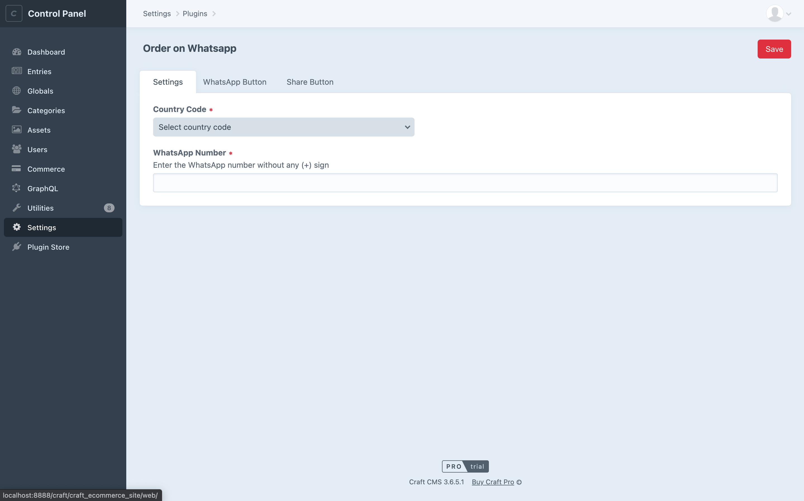
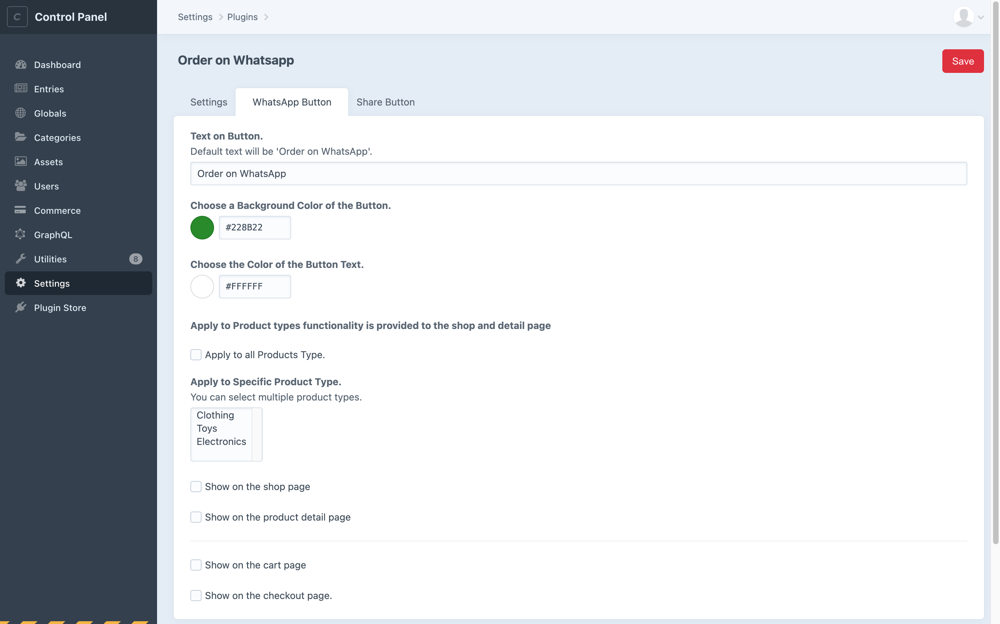
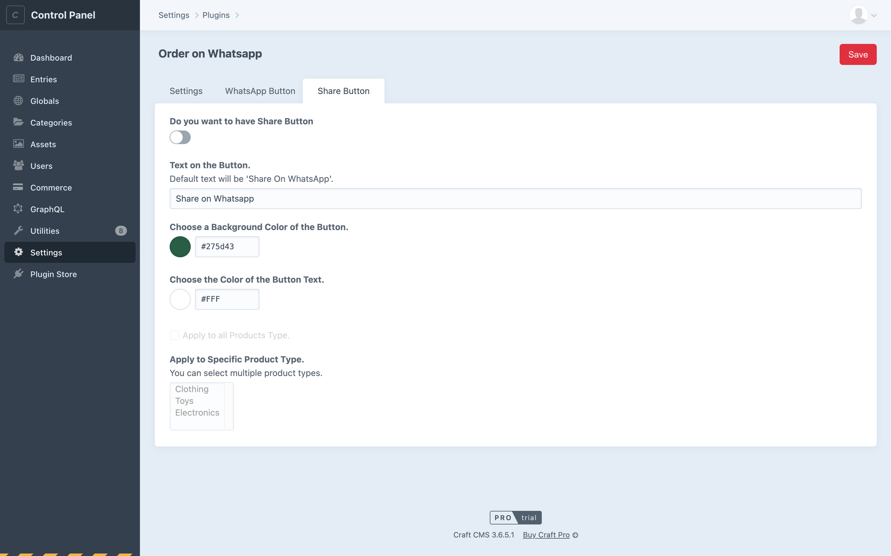

# Order on WhatsApp Plugin For Craft CMS 

This plugin allows you to place an order through WhatsApp and share a product with WhatsApp contacts by adding an **“Order on WhatsApp”** button and a **“Share on WhatsApp”** button to your website.
With the “Order on WhatsApp” button, users can send the orders directly to the vendor’s WhatsApp number. 
With the “Share on WhatsApp”, users can share details of products with their family and friends through WhatsApp.


## Requirements

The prerequisites for the Order On WhatsApp Plugin to function are: 

1. Install/activate Craft Commerce Plugin.
2. Craft CMS  Version 3.1 or greater.
3. PHP Version 7.2.5 or greater.

## Installation

You can install this plugin from the Plugin Store or with Composer.

#### From the Plugin Store

Go to the Plugin Store in your project’s Control Panel and search for “Order on WhatsApp”. Then click on the “Install” button in its modal window.

#### With Composer

Open your terminal and run the following commands:

```bash
# go to the project directory
cd /path/to/my-project

# tell Composer to load the plugin
composer require zealwhatsapporders/whats-app-orders

# tell Craft to install the plugin
./craft install/plugin whats-app-orders
```

## Major features of the Plugin

1. Accept orders on your WhatsApp account.
2. Have WhatsApp ordering feature on various pages like the shop (listing) page, product detail page, cart page, and checkout page. 
3. Add custom text to your WhatsApp button.
4. Add custom color to your WhatsApp button.
5. Apply this feature to specific product types/all products.










## General Settings

 **Country Code**   
On the Setting’s page, there will be a dropdown of all the countries with their codes. You have to select your country code.

**WhatsApp Number**    
You have to enter your WhatsApp number here. It can be a personal or commercial number.

## WhatsApp Button Settings

**Text on Button**  
You can customize the text of the button. The default text on the button will be “Order on WhatsApp”.

**Background Color of Button**  
You can customize the color of the button from here. The default color of the button is set to forest green(‘#228B22’).

**Color Of the Button Text**  
You can customize the color of the text written on the button from here. The default color of the text is set to white(‘#FFFFFF’).

**Apply to all Products**  
You can check this box if you want to have the button on all the products. If you have already checked this box, "apply to specific product" functionality will get disabled.

**Apply to Specific Product**  
If you want to have the button on specific product types, then you can select those products types from here.

**To have the button on specific pages, you have to check it from the setting’s page. For example, if you want to have the button on the list page, you have to check the “Show on the shop page”.**

## Share Button Settings

**Text on Button**  
You can customize the text of the button. The default text on the button will be “Share on WhatsApp”.

**Background Color of Button**  
You can customize the color of the button from here. The default color of the button is set to green pea(‘#275d43’).

**Color Of the Button Text**  
You can customize the color of the text written on the button from here. The default color of the text is set to  white(‘#FFFFFF’).

**Apply to all Products**  
You can check this box if you want to have the button on all the products. If you have already checked this box, ‘apply to specific product’ functionality will get disabled.

**Apply to Specific Product**  
If you want to have the button on specific product types, then you can select those products types from here.

**To have the button on specific pages, you have to check it from the setting’s page. For example, if you want to have the button on the list page, you have to check the “Show on the shop page”.**

## Usage

To include the “Order on WhatsApp” and “Share on WhatsApp” buttons in your website, you must include the below page wise mentioned code in your twig files. This code will generate the buttons in the same place. There are some classes added in the HTML for your custom use of design.

### Product Listing Page:
You can add the below code in your products loop on the “Product List” page. 
You have to pass the product id by replacing the “<Pass Product Id>” string. 
To have the link of product Image in your WhatsApp message you have to pass the url of image.

```twig


  // For order on WhatsApp button
  // For share on WhatsApp button
```
Below is the sample code for where you can add  above code in your twig file to get the buttons.
```twig

     <div class="product-details">
        {{ data.title }} </br>
        <p><b>Price:</b> {{ data.defaultPrice }}</p></br>
        
        
        
        
     </div>

```
**Note:** Product detail page link will not be provided in WhatsApp message.
### Product Detail Page:
You can add the below code to the “Product Detail” page.
You have to pass the product id by replacing the “<Pass Product Id>” string.
To have the link of product Image in your WhatsApp message you have to pass the url of image.
```twig


  // For order on WhatsApp button
  // For share on WhatsApp button
```
Below is the sample code for where you can add  above code in your twig file to get the buttons.
```twig

     <div class="product-details">
        {{ data.title }} </br>
        <p><b>Price:</b> {{ data.defaultPrice }}</p></br>
        
        
        
        
     </div>

```
**Note:** Product detail page link will  be provided in WhatsApp message.
### Cart Page:
You can add the below code in the “Cart” page where you want to display the “WhatsApp Button”.
```twig

```
**Note:** Product detail page link will not be provided in WhatsApp message.
### Checkout Page:
You can add the below code to the “Checkout” page. 
```twig

```
You can place this one line code above the ending of form tag on the checkout page.


__Brought to you by [ZealousWeb](https://www.zealousweb.com)__